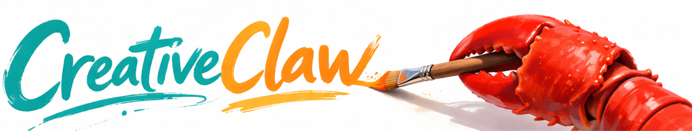

<div align="center">
  
  <h1>CreativeClaw</h1>
  <p><a href="README_zh.md">简体中文</a> · <strong>English</strong></p>
  <p><strong>Create images, understand references, improve prompts, search for ideas, and chat across CLI, Web, Telegram, and Feishu.</strong></p>
  <p>
    
    
    
  </p>
</div>

CreativeClaw turns natural-language requests into creative output.

You can ask it to generate visuals, analyze reference images, rewrite prompts, search for supporting information, and handle multi-step creative tasks from a chat interface.

If you want to try it quickly, start from the local CLI with one API key and one command.

## Why CreativeClaw

- **Built for creative workflows**: image generation, image editing, image understanding, prompt extraction, grounding, search, and video generation are first-class capabilities.
- **Easy to try locally**: you can get the local CLI running with a small setup and start prompting right away.
- **Good at iterative work**: send in a reference image, ask for analysis, then keep refining the result in follow-up turns.
- **Works in chat tools too**: start from the CLI, then connect the local web UI, Telegram, or Feishu when you want the same experience in another surface.
- **Extensible with skills**: local skills can teach the agent extra workflows, including the new MiniMax CLI skill.

## What You Can Do

- Generate poster-style, product-style, or concept images from text
- Edit or transform an existing image
- Understand the content or style of a reference image
- Turn a reference image into a better generation prompt
- Ground objects in an image
- Search the web or gather supporting information
- Generate short videos from text or image-guided prompts
- Use MiniMax through `mmx` for explicit MiniMax workflows, especially music, speech, and file-upload flows

## Quick Start

The fastest way to try CreativeClaw is the local CLI.

### 1. Set up the environment

```bash
git clone https://github.com/GML-FMGroup/creative_claw.git
cd creative_claw
python3.12 -m venv .venv
source .venv/bin/activate
pip install -r requirements.txt
python -m pip install -e .
cp .env.template .env
```

### 2. Add the minimum required API key

For the default setup, only this is required:

```env
OPENAI_API_KEY="your_api_key_here"
```

Important:

- This is enough to try the default local chat flow.
- Some image, video, search, and provider-specific features need additional keys only when you use those features.
- Full setup details are in [docs/development.md](docs/development.md).

### 3. Start chatting

If you installed the project with `python -m pip install -e .`, you can use the console script directly:

```bash
creative-claw chat local
```

If you did not install the console script yet, use the module entrypoint instead:

```bash
python -m src.creative_claw_cli chat local
```

You can also send a single request directly:

```bash
creative-claw chat local --message "Generate a poster-style cat image"
```

Or send a request with an image:

```bash
creative-claw chat local \
  --message "Describe this image and write a better prompt for recreating it" \
  --attachment ./example.png
```

## Common Usage Examples

### Generate an image

```bash
creative-claw chat local --message "Create a cinematic travel poster for Hangzhou in spring"
```

### Improve a prompt from a reference image

```bash
creative-claw chat local \
  --message "Look at this reference image and write a cleaner generation prompt" \
  --attachment ./reference.png
```

### Understand an image before editing

```bash
creative-claw chat local \
  --message "Describe this image, identify the subject, and suggest three editing directions" \
  --attachment ./input.png
```

### Start a new chat session

Inside the chat, use:

- `/help`
- `/new`

## Channels

CreativeClaw currently supports:

- **Local CLI**: the easiest way to get started
- **Local Web Chat**: a browser chat surface with progress and artifact previews
- **Telegram**: use the agent from Telegram chats
- **Feishu**: use the agent from Feishu chats

### Local Web Chat

```bash
creative-claw chat web
```

By default the server listens on `http://127.0.0.1:18900`.

You can also customize the binding:

```bash
creative-claw chat web --host 127.0.0.1 --port 18900 --title "CreativeClaw Web Chat"
```

### Telegram

After setting the Telegram-related variables in `.env`:

```bash
creative-claw chat telegram
```

### Feishu

After setting the Feishu-related variables in `.env`:

```bash
creative-claw chat feishu
```

Notes:

- `FEISHU_APP_ID` and `FEISHU_APP_SECRET` are the main required values.
- `FEISHU_ENCRYPT_KEY` and `FEISHU_VERIFICATION_TOKEN` are usually **not needed** for a basic test setup. They are only needed if you enabled the corresponding security settings in the Feishu platform.
- Web chat can also be configured from environment variables: `WEB_HOST`, `WEB_PORT`, `WEB_TITLE`, and `WEB_OPEN_BROWSER`.
- Legacy `apps/art_cli.py`, `apps/run_telegram.py`, and `apps/run_feishu.py` are still kept as compatibility wrappers during the transition.

## MiniMax CLI Skill

CreativeClaw includes a project-specific MiniMax skill at `skills/minimax-cli-skill/SKILL.md`.

Use it when:

- you explicitly want MiniMax or `mmx`
- you want MiniMax music generation
- you want MiniMax speech synthesis
- you need MiniMax file upload or `file_id`-based follow-up workflows

MiniMax CLI uses API credentials. For agent-style non-interactive usage, API key login is the recommended path:

```bash
mmx auth login --api-key sk-xxxxx
mmx auth status --output json --non-interactive
```

You usually only need this when you explicitly want MiniMax-specific workflows such as music, speech, or `mmx`-based tasks.

## Who This Is For

CreativeClaw is a good fit if you want:

- a creative AI assistant for image-heavy and prompt-heavy work
- a command-line-first workflow with optional chat channels
- a system you can use immediately, then customize later
- a tool that can grow into more advanced workflows when you need them

## More Docs

- [docs/development.md](docs/development.md): architecture, environment details, credentials, tests, and contributor-oriented notes
- [skills/minimax-cli-skill/SKILL.md](skills/minimax-cli-skill/SKILL.md): MiniMax CLI usage guidance inside CreativeClaw

## Current Status

CreativeClaw is actively evolving. The current experience is strongest for users who want to:

- run the agent locally first
- iterate on creative tasks with images and follow-up prompts
- enable only the providers and channels they actually need

If you want the smoothest first run, start with the local CLI and only `OPENAI_API_KEY`, then expand from there.
