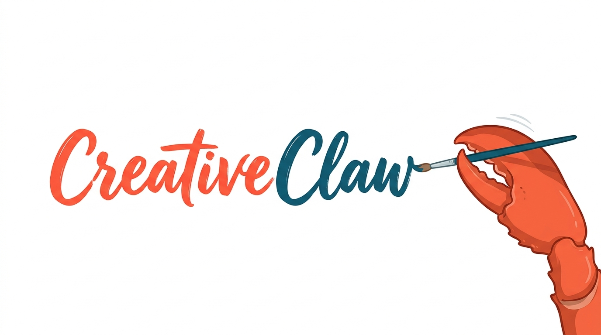

<div align="center">
  
  <h1>CreativeClaw</h1>
  <p><strong>简体中文</strong> · <a href="README.md">English</a></p>
  <p><strong>生成图片、理解参考图、优化提示词、搜索灵感，并可在 CLI、Telegram、飞书中聊天使用。</strong></p>
  <p>
    
    
    
  </p>
</div>

CreativeClaw 可以把自然语言请求转成创意产出。

你可以让它生成视觉内容、分析参考图、重写提示词、搜索辅助信息，也可以在对话里连续推进一个多步骤的创意任务。

如果你只是想先试一下，最简单的方式就是本地 CLI：配一个 API Key，跑一条命令就能开始。

## 为什么用 CreativeClaw

- **面向创意工作流**：图像生成、图像编辑、图像理解、提示词提取、目标定位、搜索、视频生成都是一等能力。
- **本地上手简单**：本地 CLI 配置很轻，几步就能开始使用。
- **适合反复迭代**：可以先发参考图让它分析，再继续追问和修改。
- **支持聊天工具接入**：可以先从 CLI 开始，后续再接 Telegram 或飞书。
- **可通过 skill 扩展**：本地 skill 可以继续教它新流程，比如 MiniMax CLI skill。

## 你可以拿它做什么

- 根据一句话生成海报风、产品风、概念风图片
- 对已有图片做修改或变体
- 理解参考图的内容或风格
- 把参考图转成更好的生成提示词
- 在图中做目标定位
- 搜索资料、灵感和补充信息
- 根据文本或参考图生成短视频
- 通过 `mmx` 使用 MiniMax 的特定工作流，尤其是音乐、语音和文件上传相关流程

## 快速开始

最推荐的入门方式是本地 CLI。

### 1. 初始化环境

```bash
git clone https://github.com/GML-FMGroup/creative_claw.git
cd creative_claw
python3.12 -m venv .venv
source .venv/bin/activate
pip install -r requirements.txt
cp .env.template .env
```

### 2. 先填写最少必需的 API Key

默认配置下，先填这个就够了：

```env
OPENAI_API_KEY="your_api_key_here"
```

说明：

- 这已经足够体验默认的本地聊天流程。
- 图片、视频、搜索、特定 provider 等功能，只有你用到时才需要补充额外 key。
- 更完整的配置说明见 [docs/development.md](docs/development.md)。

### 3. 开始聊天

```bash
python apps/art_cli.py
```

也可以直接发一条单次请求：

```bash
python apps/art_cli.py --message "Generate a poster-style cat image"
```

或者带图提问：

```bash
python apps/art_cli.py \
  --message "Describe this image and write a better prompt for recreating it" \
  --img1 ./example.png
```

## 常见用法

### 生成一张图片

```bash
python apps/art_cli.py --message "Create a cinematic travel poster for Hangzhou in spring"
```

### 根据参考图优化提示词

```bash
python apps/art_cli.py \
  --message "Look at this reference image and write a cleaner generation prompt" \
  --img1 ./reference.png
```

### 先理解图片，再决定怎么改

```bash
python apps/art_cli.py \
  --message "Describe this image, identify the subject, and suggest three editing directions" \
  --img1 ./input.png
```

### 开启一个新会话

在对话里可以使用：

- `/help`
- `/new`

## 支持的渠道

CreativeClaw 当前支持：

- **本地 CLI**：最适合第一次上手
- **Telegram**：在 Telegram 里使用
- **飞书**：在飞书里使用

### Telegram

在 `.env` 填好 Telegram 相关配置后：

```bash
python apps/run_telegram.py
```

### 飞书

在 `.env` 填好飞书相关配置后：

```bash
python apps/run_feishu.py
```

说明：

- `FEISHU_APP_ID` 和 `FEISHU_APP_SECRET` 是主要必需项。
- `FEISHU_ENCRYPT_KEY` 和 `FEISHU_VERIFICATION_TOKEN` 一般 **不需要**。只有你在飞书平台里开启了对应安全配置时才需要填写。

## MiniMax CLI Skill

CreativeClaw 现在内置了一个项目级的 MiniMax skill：`skills/minimax-cli-skill/SKILL.md`。

适合这些场景：

- 你明确想用 MiniMax 或 `mmx`
- 你想用 MiniMax 生成音乐
- 你想用 MiniMax 做语音合成
- 你需要走 MiniMax 的文件上传或 `file_id` 相关流程

MiniMax CLI 需要鉴权。对 agent 场景，推荐直接用 API Key 登录：

```bash
mmx auth login --api-key sk-xxxxx
mmx auth status --output json --non-interactive
```

通常只有你明确需要 MiniMax 特定能力时，才需要用这条 skill，比如音乐、语音或 `mmx` 专属流程。

## 适合什么人

如果你想要下面这些体验，CreativeClaw 会比较适合：

- 一个偏创意工作的 AI 助手，尤其适合图片和提示词相关任务
- 一个命令行优先、但可以继续接聊天渠道的使用方式
- 一个可以先直接用起来，之后再慢慢扩展的系统
- 一个后面能继续长出更复杂工作流的工具

## 更多文档

- [docs/development.md](docs/development.md)：架构、环境、凭证、测试、开发者说明
- [skills/minimax-cli-skill/SKILL.md](skills/minimax-cli-skill/SKILL.md)：CreativeClaw 中的 MiniMax CLI 使用说明

## 当前状态

CreativeClaw 还在持续迭代中。当前最适合的使用方式是：

- 先从本地 CLI 开始
- 先跑图片和提示词相关流程
- 只开启你真的需要的 provider 和聊天渠道

如果你想要最顺畅的第一次体验，建议先从本地 CLI 和 `OPENAI_API_KEY` 开始，跑通后再逐步增加其他能力。
